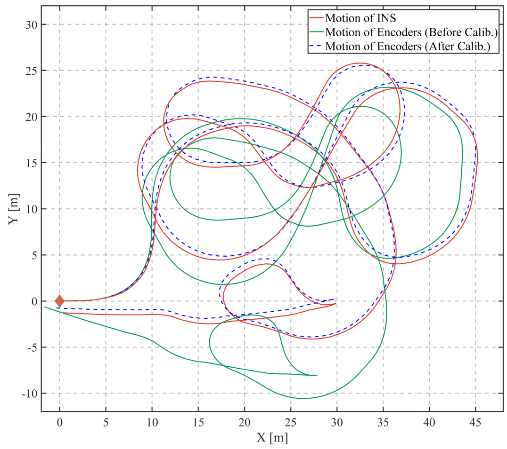

## Encoder Calibration Tools
This project is to calculate wheel encoder intrinsic(wheel radius and track) with gnss and gyro Result shows in the picture.

### Installation
1. Install dependecies: ```sudo apt install libgeographic-dev```

### Run
1. Build the package: ```catkin build encoder_calc```
1. Run the code ```rosrun encoder_calc encoder_calc```
2. Visualization ```demo.rviz``` to visual encoder and gps path(encoder path calculate from default parameters)
3. Run the ROSbag ```rosbag play ugv_parking00.bag -r 20```
4. Call Service```rosservice call /encoder_result/cali_encoder```
5. Obtain the calibration result. 
    Example: 0.218323 0.218349 0.783034 -1.0585 -0.274179 -0.845402 (radius_left, radius_right, track, gnss_yaw_2_wheel) in the terminal the visualize the refine encoder path in rviz

### Notice
1. use gps cov <0.5 and add gps data per 0.5m for calibration(edit this value in main.h).
2. yaw angle calculate from imu (imu of 3dm is downward, imu_yaw -= w * delta_t, use "+=" for upward imu )
3. set the extrinsic between gps and wheel in "gps2wheel" and edit corresponding gps topic

### Results

<p align="center">
	
</p>

## Contributors
Mr.Xupeng Xie and Mr.Yilong Zhu from the Hong Kong University of Science and Technology
